# Mantis User Guide
[Mantis](https://spectromicroscopy.com/) was developed by [2nd Look Consulting](https://2ndlookconsulting.com/).


##  Introduction
MANTiS is **M**ultivariate **AN**alysis **T**ool for **S**pectromicroscopy developed in Python. It uses Principal Component Analysis (PCA) and cluster analysis to classify pixels according to spectral similarity, as well as singular value decomposition for calculating image thicknesses based on known spectra; latest addition includes Non-Negative Matrix Approximation or NNMA-based analysis. The program is based on the earlier programs [stack_analyze](http://dx.doi.org/10.1046/j.1365-2818.2000.00640.x) and [pca_gui](http://dx.doi.org/10.1016/j.ultramic.2004.01.008)  in the [IDL](http://www.exelisvis.com/ProductsServices/IDL.aspx)  programming language by Mirna Lerotic and Chris Jacobsen of the Stony Brook University x-ray microscopy group (the Stony Brook group moved to [Northwestern University](http://xrm.phys.northwestern.edu)  in 2010). Initial development of MANTiS was supported by Argonne National Laboratory under LDRD project 2010-193-R1 9113, with further enhancements supported under LDRD 2013-168-N0.

The [paper](http://dx.doi.org/10.1016/j.ultramic.2004.01.008)  of Lerotic _et al._, _Ultramicroscopy_ **100**, 35-57 (2004), provides the mathematical description. In experiments one measures a set of images over _N_ energies and _P_ pixels, leading to a data matrix _D_<sub>_N_ x _P_</sub>.  One would like to describe this as a product of a set of spectra _u_<sub>_N_ x _S_</sub> and a set of thickness or weighting maps _t_<sub>_S_ x _P_</sub>; in this case _S_ indexes a set of spectroscopically distinct components that one would like to discover.  If one already knows a set of spectra for all chemical components in the sample, the matrix _u_<sub>_N_ x _S_</sub> is already determined and one can simply find the thickness maps with _t_<sub>_S_ x _P_</sub>=(_u_<sub>_N_ x _S_</sub>)<sup>-1</sup>._D_<sub>_N_ x _P_</sub>. When one does not know all of the spectra  _u_<sub>_N_ x _S_</sub> in advance, MANTiS provides a way to discover these spectra from correlations in the data.

MANTiS presents the user with a sequence of panels to guide the analysis workflow.  This sequence is illustrated in the following schematic:

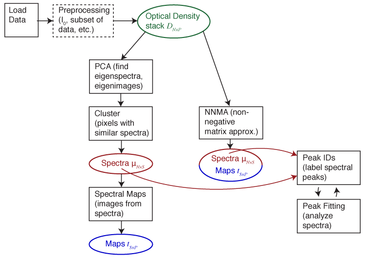

**Figure 0** Workflow Schematic

----

## Installation
Mantis is available via PyPi as [mantis-xray](https://pypi.org/project/mantis-xray/)! To install (with Python 3) run from a terminal:
```
pip install mantis-xray
```
Then to start Mantis run
```
python3 -m mantis-xray
```
Alternatively, a local copy of the spectromicroscopy Git repository can be made with this command:
```
git clone https://github.com/mlerotic/spectromicroscopy.git
```

The program requires Python 3 and following dependencies:
				
 - [PyQt5](http://www.riverbankcomputing.com/software/pyqt/)
 - [Numpy](http://numpy.scipy.org/)
 - [Scipy](http://numpy.scipy.org/)
 - [Matplotlib](http://matplotlib.sourceforge.net/)
 - [h5py](http://code.google.com/p/h5py/)
 - [Python Imaging Library (PIL)](http://www.pythonware.com/products/pil/)
 - [lxml](https://lxml.de/)
 - (Optional) [netcdf4-python](http://code.google.com/p/netcdf4-python/)

Python 2.7 with PyQt4 version of Mantis is still available on Github as a separate branch and [binaries](https://github.com/mlerotic/spectromicroscopy/releases/tag/2.3.02) but it will not be updated with new features. The user guide for 2.3. Mantis version can be dowloaded [here](https://github.com/mlerotic/spectromicroscopy/files/5944025/UserGuide_2.3.02.pdf).

We recommend using pip [Python Packaging](https://packaging.python.org/tutorials/installing-packages/) to install required libraries. Alternatively, [Anaconda Python](http://docs.continuum.io/anaconda/)  includes all the required libraries in compatible versions. Enthought Python Distribution [EPD](http://www.enthought.com/products/epd.php) is another option.

## Download
Alternatively, old versions of Mantis executables can be downloaded at http://spectromicroscopy.com/. Executables can be used without Python installation and are available for many operating systems. 


## Processing your data
To carry out your analysis via PCA and clustering (see the above figure), you need to go through the following steps:

  1. Loading your data
  2. Preprocessing: alignment, normalization to optical density, removal of artifact images
  3. PCA (principal component analysis): orthogonalization of spectra (generation of eigenspectra), and selection of _S_ principal components (removal of noisy eigenspectra)
  4. Cluster analysis: grouping of spectroscopically similar pixels together to find a representative set _S_ of spectra (_i.e._, to discover _u_<sub>_N_ x _S_</sub>)
  5. Spectral Maps: calculation of thickness or weighting maps _t_<sub>_S_ x _P_</sub> from _t_<sub>_S_ x _P_</sub>=(_u_<sub>_N_ x _S_</sub>)<sup>-1</sup>._D_<sub>_N_ x _P_</sub>.  This step is also known as target mapping: you obtain maps of the distribution of a set of target spectra.
These steps are described in turn below.
6. NNMA Analysis: Non-negative matrix analysis for effective feature extraction 
7. Peak IDs: once you have a set of spectra _u_<sub>_N_ x _S_</sub>, you can either load or build a list of names and energies of functional group peaks you expect to find in the spectra (e.g., C=C aromatic bonds at 285.0 eV).
8. Peak Fitting: here you can fit a particular spectrum _u_<sub>_N_ x _s_</sub>, for a particular component _s_ to a set of near-edge absorption resonances and an absorption edge step.
9. Tomography: compressed sensing reconstruction algorithm for 4D datasets  
10. Image Maps: creating image maps by comparing images at different energies

###  Reading your data
The first step in using Mantis is to read in a set of images over known photon energies (a _stack_).

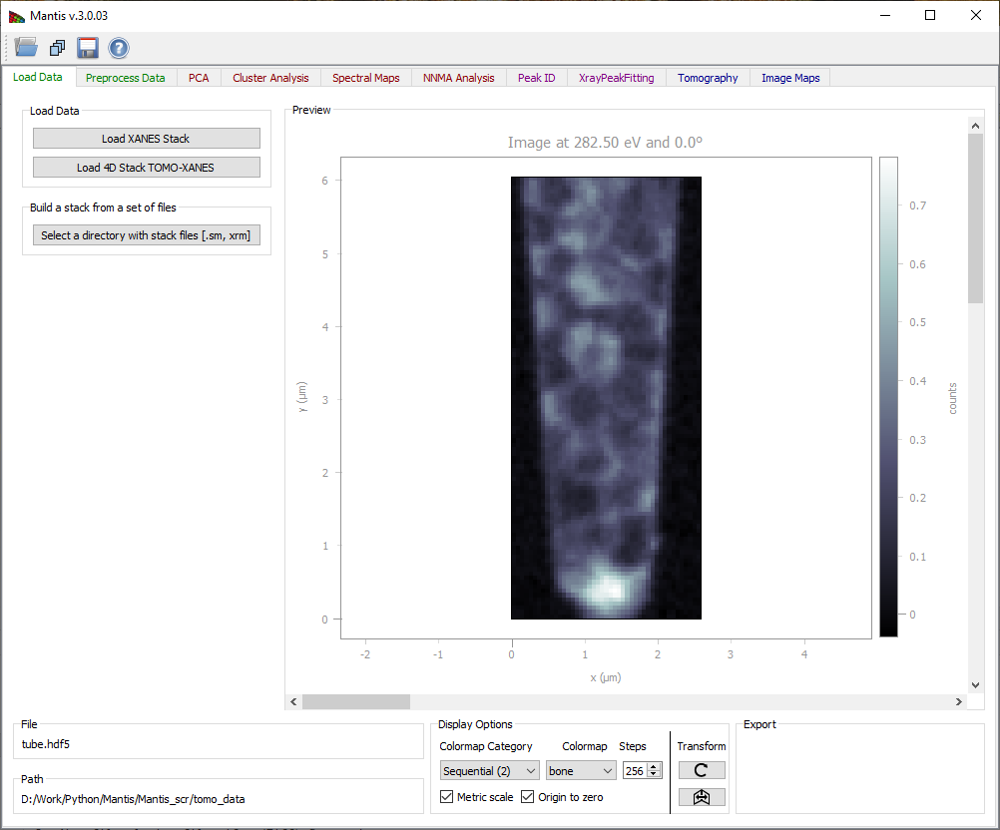

**Figure 1** Load Data Tab. Loaded images can be viewed using the scroll-bar and arrows on Windows and Linux; on Mac the arrows are no longer available but the same functionality can be imitated by clicking on the scroll-bar and using arrow keys on the keyboard. 

----


To read in a pre-organized stack of files, use the 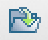 *read stack* icon. At present, Mantis is able to read stacks in the following formats:
  * `.hdf5` or `.h5` [HDF5](http://www.hdfgroup.org/HDF5/) files organized in the [DataExchange](http://www.aps.anl.gov/DataExchange/) schema developed at Argonne National Laboratory.
  * `.hdr` self-describing files (SDF) initially developed for the ALS Scanning Transmission X-Ray Microscope (STXM) at beamline 5.3.2. (used by ALS and SLS).
  * `.stk` [XDR](http://en.wikipedia.org/wiki/External_Data_Representation) files as created by the  [`stack_analyze`)[http://dx.doi.org/10.1046/j.1365-2818.2000.00640.x) IDL program developed by the x-ray microscopy group at Stony Brook University.
 * `.xrm` OLE Compound single energy files. The file format was developed by [Xradia](http://www.xradia.com/). 
 * `.txrm` OLE Compound files. The file format was developed by [Xradia](http://www.xradia.com/).
 * `.tif` Multi-Page TIFF files. A list of corresponding energies (in eV) has to be stored in a .txt file with the same file name as the data (e.g., mydata.tiff and mydata.txt). Multi-Page .tiff file can be created from individual .tiff images using [ImageJ](http://imagej.net/Welcome).
More formats can be accommodated by request.

To build a stack from a set of individual images, use the  *open directory* icon.  This will allow you to read in a sequence of files. Supported single energy file formats are
  * `.sm` [NetCDF](http://www.unidata.ucar.edu/software/netcdf/) files written by the soft x-ray scanning transmission x-ray microscope developed by Stony Brook University and formerly operated at beamline X1A at NSLS at Brookhaven; and
  * .xrm OLE Compound single energy files, in a format developed by [Xradia)http://www.xradia.com/).

Again, more image file types can be accommodated by request.  This is illustrated in Fig. 2.


**Figure 2** The *open directory* widget is used to build an image stack from a list of files (in this case, a set of  `.sm` [NetCDF](http://www.unidata.ucar.edu/software/netcdf/) files written by the soft x-ray scanning transmission x-ray microscope developed by Stony Brook University and formerly operated at beamline X1A at NSLS at Brookhaven). You pick a starting and ending file, and then these files (plus all in between) are used to create a list of files that belong to a stack.

----

### Preprocessing of your data: the Image Stack tab
Once you have read in a sequence of files, you have an assembled stack for examination and preprocessing. A suggested workflow is as follows:
  * Align your image sequence.
  * Normalize your images to obtain the optical density (in the case of transmission imaging).


**Figure 3** Preprocess Tab 

----

### Image Alignment
Acquiring images at successive energies often requires that a focusing stage be adjusted, and these stages often have a runout error which causes the center position of the image to shift.  One must therefore align the stack to eliminate image-to-image wobble; this is done using the **Align images** button which brings up the window shown in Fig. 4.

The **Registration** or automatic alignment routine attempts to align images by Fourier cross-correlation.  The first step is to drag the slider to the right of the left-hand image to select a photon energy with an image that is sharp and with good contrast; you then click on **Set as Reference Image**.  You then click on the **Register Images** button to start the automatic alignment procedure; if you have checked the **Show Cross-correlation** box you'll see how the calculation proceeds (at a cost in speed due to the need to display a large number of images).  The program goes through and calculates the **Image shifts** in pixels between successive images and the reference image.  At the end of this process, you should click on **Crop Aligned Images** to trim the edges that are present in only a subset of the image sequence.

Sometimes the automatic alignment routine just cannot seem to get a stack to align; for example, there might be similar features present at different locations in the image and the alignment routine might suddenly align feature A in image 1 with feature B in image 2. You may then want to resort to **Manual Alignment**. In this procedure, you are told first to **Pick a point on reference image**, where you should use a readily-identified fine feature in the reference image. You will then be asked to **Pick a corresponding point** or to click on this same feature in each of the images in the stack.  When you're done, you must click on **Apply manual shifts** to apply the new alignment to the stack.

**Crop Aligned Images** will crop the images to a region of pixels that are present in every single image in the stack. That is, as images have been shifted around in alignment, there may be some features that appear at the edges of some images but fall outside the field of view of other images. These edges which are not present in all of the files are clipped out.

**Remove Image** will remove the displayed image from the stack. 

**Accept changes** will apply the registration shifts to the stack and return to the main frame.


**Figure 4** The image alignment window.

----

### Image Normalization 
Once your images are aligned, you can now thing about normalization of the images in the **Image Stack** window. Often in experiments the transmitted flux _I_ is recorded, but this decays exponentially with sample thickness _t_ as _I_=_I_<sub>0</sub>exp(-<i>ut</i>), where _u_ is the absorption coefficient (the same _u_ as obtained from a specific photon energy _n_ and chemical component _s_ from _u_<sub>_N_ x _S_</sub>).  For spectromicroscopy analysis, it is preferable to work instead with the optical density _D_=-log(_I_ _/I_<sub>0</sub>)=_ut_ which is linear with specimen thickness.  To calculate the optical density matrix _D_<sub>_N_ x _P_</sub>, you need to obtain the incident flux spectrum _I_<sub>0</sub>(_N_).  This can be obtained from a blank area in the image stack, or from a separate measurement; both can be determined from within the **Preprocess Data** tab in Mantis as shown in Fig. 2.


### Evaluating your images: the Preprocess Data tab
The **Preprocess Data** tab displays the page shown in Fig. 2. After the image stack has been loaded, an image and a spectrum will be displayed. One can view images acquired at different photon energies using either the slidebar to the right of the image, or by clicking on the spectrum at the desired energy. One can also change the pixel from which the spectrum is displayed by clicking at points on the image.  If the data is normalized, you can chose to display either the transmitted flux _I_ or the optical density _D_.


### Preprocess tab
There are two methods for determining the incident flux spectrum _I_<sub>0</sub>(_N_):
 * **I0 from file** reads in an _I_<sub>0</sub>(_N_) spectrum file, in case you have it in a separate measurement. The spectrum should be saved in a simple ASCII format of (eV, flux in kHz) stored line-by-line, such as a `.csv` file (comment lines that start with text or non-numeric symbols will be ignored). You should make sure that this file was recorded under similar conditions, like the same slit settings, ring current, and so on.
 * **Select I0**  is used to determine the _I_<sub>0</sub> spectrum from the histogram of image intensities.  This is described in the caption of Fig. 5.


**Figure 5** Clicking on **Select I0** produces this window, which displays a histogram of image intensities (top).  One can then obtain a _I_<sub>0</sub>(_N_) spectrum by picking the pixels with the greatest average signal level, such as the pixels corresponding to a whole in the image.  By clicking and dragging over an energy range, one obtains a red box indicating the flux range used for the _I_<sub>0</sub>(_N_) spectrum in the histogram at top, and these pixels are highlighted in red in the image below. It is also possible to select an _I_<sub>0</sub>(_N_) region by drawing on the image. 

----

**Show I0** displays the _I_<sub>0</sub>(_N_) normalization spectrum.

**Crop Stack** button brings up a frame shown on Fig. 6. This allows one to exclude images outside of a defined energy range from subsequent analysis.  Sometimes the best results are obtained by limiting cluster analysis to the energy range of the near-edge absorption "wiggles" only, without the extended pre-edge and post-edge spectral regions that are otherwise useful for absorption calibration. Stack pixel range can also be cropped by draging the small quadrangle in the top right corner and moving the resulting frame.

**Save images** button displays a frame where different things can be saved as .png, .pdf, or .svg files.   The .pdf and .svg files use vector graphics and font-based text, so you can use a program like Adobe Illustrator or Inkscape to tweak the graphics output files.


**Figure 6** The **Crop stack** window of Mantis.  By dragging the mouse across an energy region, one can define a limited range used for subsequent spectromicroscopy analysis. Pixel range can be cropped by changing the frame on the image.

----


### Display settings
**Despike** When using a gas-filled proportional counter, sometimes you can get single pixels with very large values (one or a few bright white dots) due to electrical discharges, cosmic rays hitting the detector, and so on. This option looks for such pixels and sets them to the average of their neighboring pixels for all images in the stack.

You can choose to display either the transmitted flux or the optical density OD = −log (I/I0).
You can adjust the contrast of the image by playing with Minimum, Maximum, and Gamma. The image is displayed as

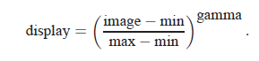

The program starts out displaying the full range of the data at a contrast of gamma=1. 

**Color Table** is used to adjust the colormap used to display the image  Colors button.


### Region of Interest
Spatial regions of interest (ROIs) are sets of pixels from which one averages the individual spectra to obtain an ROI spectrum.
**Select ROI (Lasso)** will enable you to start defining a new Region of Interest (ROI) as shown on Fig. 6. After clicking the button you can then define a region drawing on the image. If a ROI is already present and accepted, the new region will be added to the old one. When the ROI is defined, the ROI spectrum obtained by averaging the per-pixel spectra within this area will be shown. 

**Reset ROI** will reset ROIs and return to regular use (showing single pixel spectra)

**Save ROI Spectrum** will save the ROI spectrum as a .xas file, which is a plain text file of ev, signal per line (e.g., Microsoft Excel can read it as a .csv or comma space value file).

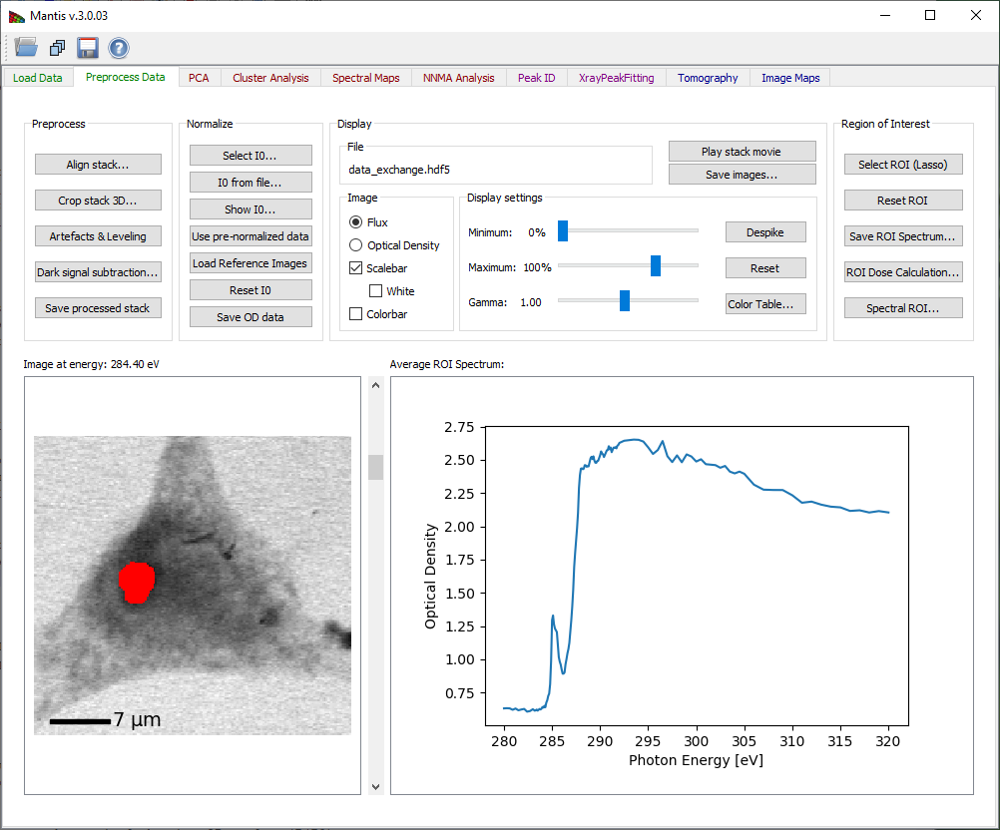

**Figure 7** Selecting a Region of Interest.

----


**Spectral ROI** lets you can average a number of images in the pre-edge spectral region for a single I0 image, and a number of images in a post-edge spectral region for a single I image (you can also use just one file for each spectral region). This lets you get a very high signal-to-noise ratio for making a map or image of the optical density of a selected element (for example by using several images below and then above in energy the Carbon absorption edge). The panel is shown on Fig. 8.


**Figure 8** Spectral ROI is used to calculate an element map.   Pre-absorption-edge and post-edge regions are selected by directing a user to by dragging the mouse across an energy regions.

----


## PCA tab

Principal Component Analysis (PCA) tab is used to calculate eigenspectra and eigenimages from the image stack. The eigenspectra are an orthogonal set of spectra that, in linear combination, can describe any observed spectrum in the dataset.  The eigenvalue associated with each eigenspectrum gives a typical weighting of that eigenspectrum in the entire data set, so that the later eigenspectra (with small eigenvalues) represent less and less common variations in the data.  For this reason it is often possible to have an excellent approximation of all observed spectra using a linear combination of only a limited set of eigenspectra (the principal components); finding this limited set is what PCA is all about.

Because optical density OD is used for the calculation it is necessary to define a normalization spectrum I0. If the data was normalized beforehand and a normalization spectrum is not required, a .xas file with flux values of -1.0 can be loaded. 

If the image stack and I0 spectrum are both loaded, the **Calculate PCA** button of Fig. 9 becomes sensitive. The button launches the calculation of principal components. 

The PCA tab has three graphic areas which display eigenimages, eigenspectra, and eigenvalues. Eigenvalues are depicted in the plot on upper right corner. The current eigenimage is shown on the lower left corner in a blue-red intensity scale. The scale is such that negative values are scaled red, positive values blue, and zero is white. The current eigenspectrum is shown in the lower left corner. The slider to the right of the eigenimage plot is used to select which eigenimage and eigenvalue are shown. 

Your goal in examining eigenspectra and eigenimages is to select the number of significant components present in the sample. You can generally tell when components become insigificant by observing a “salt and pepper” pattern in eigenimages (indicating that the component is showing only random rather than systematic variations of signal from pixel-to-pixel), and random fluctuations in the eigenspectra. Based on this examination, you should adjust the **Number of Significant Components** to be used in further analyses of the data. Initial estimation of the number of significant components is calculated using  [the Cattell scree test](http://www.tandfonline.com/doi/abs/10.1207/s15327906mbr0102_10), where the number of significant components is given by detecting an "elbow" in the eigenvalue plot. Cumulative variance captured by the Significant Components is displayed. 


**Save** button displays a frame where different things can be saved as .png, .pdf, or .svg files.

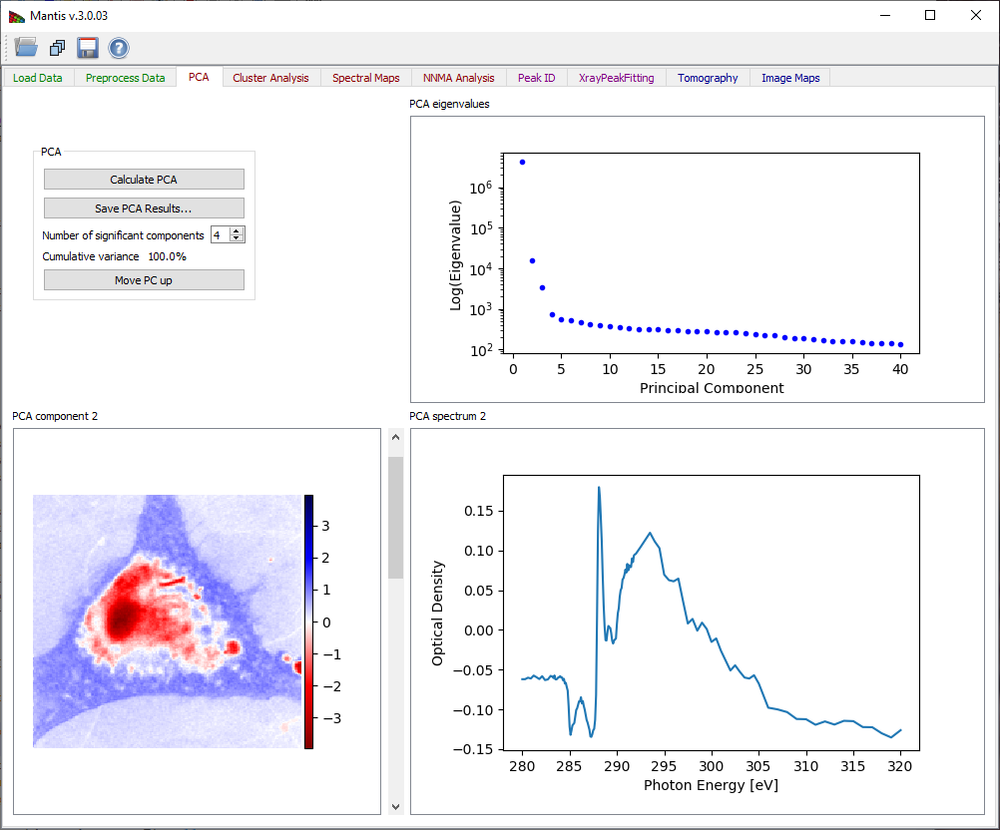

**Figure 9** Principal component analysis tab. After pressing the **Calculate PCA** button, you must decide the number of significant components based on observations of the eigenvalues, eigenimages, and eigenspectra.

----


## Cluster Analysis tab

The **Cluster analysis** tab shown in Fig. 10 is used to classify data in the image stack according to spectral similarities. When searching for clusters, you are looking for pixels with similar weightings of eigenspectra. Therefore the **Calculate Clusters**  button becomes sensitive only after Principal Components have been calculated in the PCA Tab. Before running cluster analysis it is required to choose the **Number of clusters** to be sought with the  slide-bar in the upper left corner. Generally speaking it’s suggested that you search for several more clusters than the number of components you have identified as significant.

In some cases, it is also useful to exclude the first component from the cluster search, so as to reduce sensitivity to thickness variations (the first component represents the average absorption spectrum present in the dataset, while subsequent components represent variations from that average in decreasing significance). **Reduce thickness effects** will preform cluster analysis without the first component.

While _k_-means clustering attempts to cluster pixels together based on minimum Euclidian distances in eigenspectrum-weighting space, it sometimes delivers clusters where one or a few pixels with unique spectroscopic signatures are incorrectly grouped with a large number of more self-similar pixels.  Selecting the option of **Divide clusters with large Sigma** will look for the cluster with the biggest variance of Euclidian distances from the cluster center, and break it into two clusters.

Once you have decided upon the above settings, click on **Calculate Clusters** to start the clustering calculation. When the calculation is finished, results are displayed on four graphical areas:

  * Composite cluster image: A pseudo-color image of cluster pixels for first twelve clusters is generated by displaying members of different clusters with different colors.
  * Cluster _i_: An image of pixels which are part of the currently-selected cluster is shown in the upper right corner. The index for this cluster can be chosen using the slider to the right of the image.
  * Cluster _i_ spectrum: The spectrum of the current cluster is displayed in the lower right corner.
  * Cluster distance map: Distances from cluster centers provide a way to detect errors in clustering. This image shows scaled distances from pixels to their respective cluster center, with white pixels being the farthest away (i.e., the least similar spectroscopically to the other pixels in their respective cluster). 

**Show scatter plots** button opens the scatter plot widget shown on Fig. 11.

**Save CA results** button displays a frame where images, spectra, and/or scatterplots can be saved as .png, .pdf, .svg, or .hdf5 files.

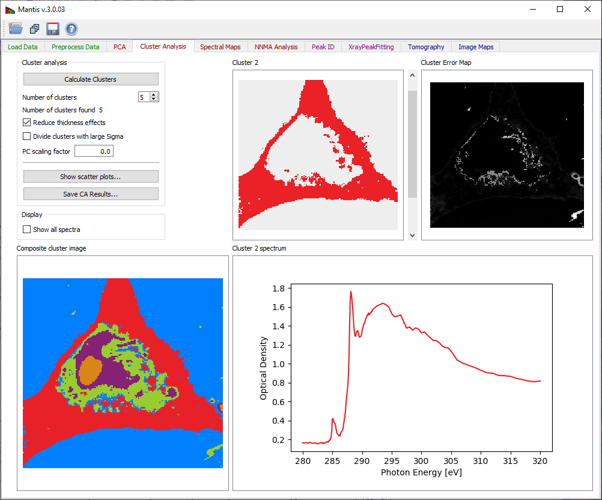

**Figure 10** Cluster analysis tab.

----


**Figure 11** The scatter plot shows pixels plotted according to their weights in two selected component axes. Because clustering is done over a number of dimensions equal to the number of selected components, a particular two dimensional view will give an incomplete sense of how the data are clustered.

----


## Spectral Maps tab

The Spectral Maps tab shown in Fig. 12 allows one to get thickness or spectral weighting maps _t_<sub>_S_ x _P_</sub> from already-known spectra _u_<sub>_N_ x _S_</sub>, whether from the cluster spectra (if clustering has been done) or from a different set of spectra loaded into MANTiS.

Once any spectrum has been loaded, thickness maps are calculated according to _t_<sub>_S_ x _P_</sub>=(_u_<sub>_N_ x _S_</sub>)<sup>-1</sup>._D_<sub>_N_ x _P_</sub> even for as few as _S_=1 spectra.  This means that the spectra should have units of linear absorption coefficients in inverse micrometers (the _u_ in exp[-<i>ut</i>]).   If you have multiple spectra to include, simply continue loading the additional spectra; if you choose instead to **Add Cluster Spectra** you will get the entire set of thickness or spectral weighting maps corresponding to the full set of cluster spectra.

If you know all spectra, you can get thickness maps using SVD by selecting **Load Spectrum** to load any known target spectra as linear absorption c (“mu”) in a .xas file format.

The option **Add flat spectrum** loads one “flat,” constant-at-all-energies spectrum for evaluating fit residuals.

**Add cluster spectra** loads all cluster spectra from the current cluster analysis. 

The list of loaded **Target Spectra** is shown in the upper right corner.

**Remove spectrum** removes the displayed target spectrum. *Move spectrum up** moves a displayed spectrum up in the list, while **Move spectrum down** moves a displayed spectrum down in the list. There is also an option to show maps from raw spectra or spectra fitted with principal components (Composition Map).

The current target spectrum is shown in the lower left corner. The slider to the right of the  plot is used to select which target spectrum and thickness map are shown. The plot shows raw spectrum as well as spectrum fitting with PCA components and absolute difference spectrum. The fit weights for the current spectrum are displayed under **Fit Weights**.

After the spectrum is loaded, the calculated thickness map is shown on the lower left corner in a white-red intensity scale. The scale is such that negative values are scaled red, positive values white, and zero is black.


**Figure 12** Spectral Analysis tab.

----

**Composite RGB image** can be created using the widget shown on Fig 13. 


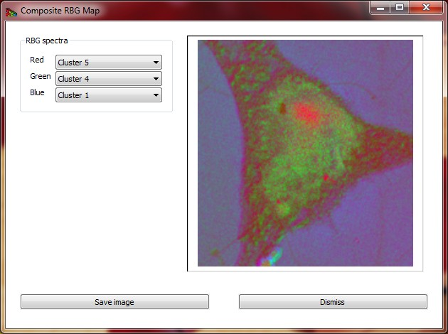

**Figure 13** Composite RGB image created from three selected spectra.

----


## Peak ID tab

The Peak ID tab shown in Fig 14 can be used to identify peaks by comparing them to a set of predefined peak energies. 

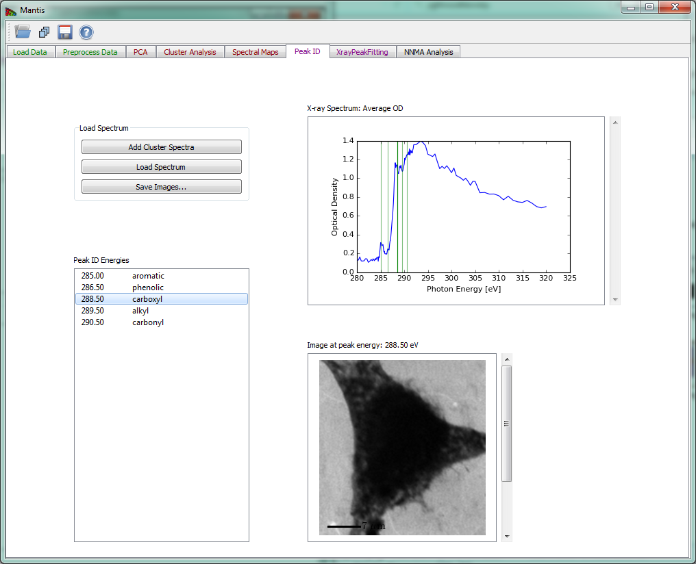

**Figure 14** Peak ID tab

----


## Xray Peak Fitting tab

The Xray Peak Fitting tab shown in Fig 15 can be used to fit the spectra using Step, Gaussian and Base spectra. To fit a spectrum first load the spectra from either cluster analysis with **Add cluster spectra** or from a file with **Load spectrum**. After spectra have been loaded choose the number of peaks and steps to fit using **Number of steps** and **Number of peaks** and set the initial parameters in **Fit Parameters**. Once you have set the initial parameters, click on **Fit Spectrum** to start the fitting. When the fitting is finished, results are overlaid on a spectrum and the peak positions are listed bellow.  

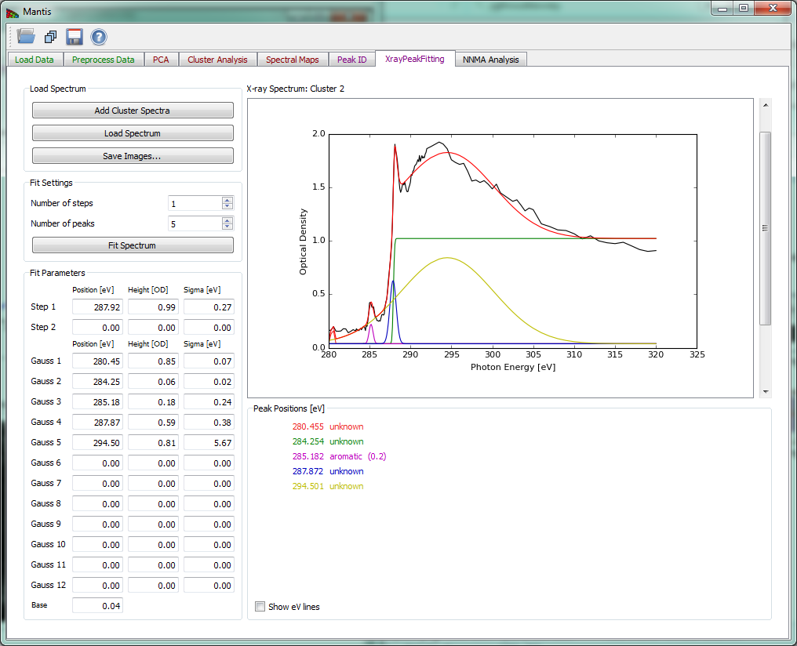

**Figure 15** Xray Peak Fitting tab

----


## NNMA Analysis tab

To counter the unphysical negative weightings produced in cluster analysis, non-negative matrix approximation (NNMA) analysis was introduced to extract features while constraining the weightings to be non-negative. 'Cluster spectra similarity' regularization, where we input the initial spectra from cluster analysis, is used to tune how closely the reconstructed NNMA spectra should match those calculated using cluster analysis.  We have found that the combination of sparseness and cluster spectra similarity regularizations gives favorable results in terms of feasible spectra and thickness maps. 

Because optical density OD is used for the calculation it is necessary to define a normalization spectrum I0. If the data was normalized beforehand and a normalization spectrum is not required, a .xas file with flux values of -1.0 can be loaded.

If the image stack and I0 spectrum are both loaded, the **Calculate NNMA** button of Fig. 16 becomes sensitive. The button launches the calculation of NNMA. Before running the calculation you should load a set of initial spectra from one of the three options:
 # **Load initial cluster spectra** will load a set of spectra that were calculated using Cluster analysis. This button will become sensitive after cluster spectra have been calculated using **Cluster Analysis** tab. We have found that using cluster spectra ass initial guess for NNMA produces the best results. 
 # **Load initial standard spectra** a set of initial spectra can be loaded from files in either 'csv' or 'xas' format. Multiple spectra can be loaded from the file dialog.
 # **Load initial random spectra** will define a set of random spectra that will be use a starting spectra for NNMA.

Before running NNMA analysis it is required to choose the "Number of components k"  to be sought with the slide-bar in the "NNMA settings" section. If using cluster or standard spectra make sure that the number of components k is equal to the number of initial spectra that where loaded. 

**Regularization parameters** can be used to tune the analysis by giving more or less emphasis to different constraints.

The recommended steps to run NNMA are

 * Load the stack.
 * If stack was not normalized, run the normalization (see Image Normalization).
 * **Calculate PCA** using the **PCA Tab** and then choose the number of significant components.
 * Choose the **Number of clusters** and **Calculate Clusters** on **Cluster Analysis** Tab.
 * Select **NNMA Analysis** tab:
	* Set the **Number of components k** to be the same as the number of clusters used in step 4.
	* **Load initial cluster spectra** to initialize starting spectra.
	* **Calculate NNMA** to run the analysis. 

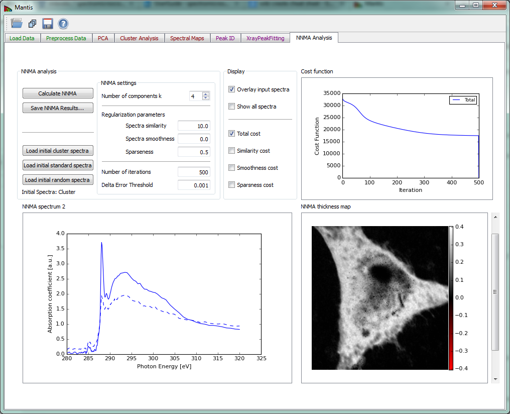

**Figure 16** NNMA Analysis tab

----

## References
  * Lerotic M, Mak R, Wirick S, Meirer F, Jacobsen C. MANTiS: a program for the analysis of X-ray spectromicroscopy data.  J. Synchrotron Rad. 2014 Sep; 21(5); 1206–1212  - [http://dx.doi.org/10.1107/S1600577514013964](http://dx.doi.org/10.1107/S1600577514013964)

  * Mak R, Lerotic M, Fleckenstein H, Vogt S, Wild SM, Leyffer S, Sheynkin Y, Jacobsen C. Non-Negative Matrix Analysis for Effective Feature Extraction in X-Ray Spectromicroscopy. Faraday Discussions. 2014 Apr; 171- [http://doi.org/10.1039/C4FD00023D](http://doi.org/10.1039/C4FD00023D)
  
  * Lerotic M, Jacobsen C, Gillow JB, Francis AJ, Wirick S, Vogt S, Maser J. Cluster analysis in soft X-ray spectromicroscopy: Finding the patterns in complex specimens. Journal of Electron Spectroscopy and Related Phenomena. 2005 Jun; 144–147, p:1137-1143 - [http://dx.doi.org/10.1016/j.elspec.2005.01.158](http://dx.doi.org/10.1016/j.elspec.2005.01.158 )
  
  * Lerotic M, Jacobsen C, Schäfer T, Vogt S. Cluster analysis of soft X-ray spectromicroscopy data. Ultramicroscopy. 2004 Jul; 100(1–2), p:35-57 - [http://doi.org/10.1016/j.ultramic.2004.01.008](http://doi.org/10.1016/j.ultramic.2004.01.008)

Please use the following reference when quoting Mantis

Lerotic M, Mak R, Wirick S, Meirer F, Jacobsen C. MANTiS: a program for the analysis of X-ray spectromicroscopy data.  J. Synchrotron Rad. 2014 Sep; 21(5); 1206–1212